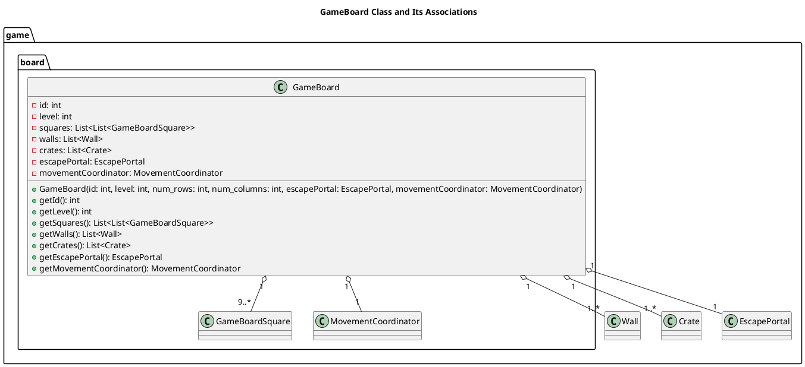
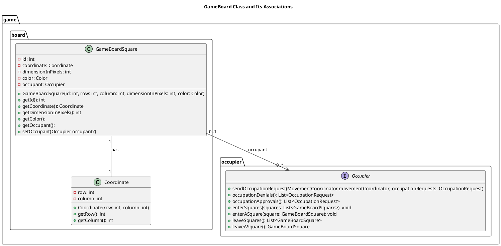

# Package `game.board`

## Table of Contents
1. [Purpose](#purpose)
2. [The `GameBoard` Class](#the-gameboard-class)
   1. [`GameBoard` Immutable Properties](#gameboard-immutable-properties)
   2. [`GameBoard` Mutable Properties](#gameboard-mutable-properties)
   3. [`GameBoard` UML Relationship Diagram`](#gameboard-uml-relationship-diagram)
3. [The `GameBoardSquare` Class](#the-gameboardsquare-class)
   1. [`GameBoardSquare` Immutable Properties](#gameboardsquare-immutable-properties)
   2. [`GameBoardSquare` Mutable Properties](#gameboardsquare-mutable-properties)
   3. [Concrete Subclasses of `GameBoardSquare`](#concrete-subclasses-of-gameboardsquare)
   4. [`GameBoardSquare` UML Relationship Diagram](#gameboardsquare-uml-relationship-diagram)
4. [The `MovementCoordinator` Class](#the-movementcoordinator-class)
5. [Package Dependencies](#package-dependencies)

---
## Purpose
TClasses and components related to the surface where the player interacts 
with the system and navigates obstacles to win. The package main classes are.

- `GameBoard`
- `GameBoardSquare`
- `MovementCoordinator`

---
### The `GameBoard` Class
- Comtroller or View-Model which updates the screen
- A `GameBoard` is a 2-D array of `GameBoardSquare` items. Cells can be referenced by their
`row` and `column.
- A collection of type `GameFigure` is associated with each G`GameBoard`

---
#### `GameBoard` Immutable Properties
These are permanently on the board during its lifecycle.
- ***`id`:***
- ***`level`:*** The level of difficulty
- ***`num_rows`:*** Size of `List<GameBoardSquare>` representing y-coordinate. 
- ***`num_columns`:*** Size of `List<GameBoardSquare>` representing x-coordinate. 
- ***`List<Obstacle>`:***
- ***`EscapeSquare`:*** The player wins the level by landing on the `EsapeSquare`.
- ***`List<Vehicle>`:***

--- 
#### `GameBoard` Mutable Properties
These can be added to or removed from the board making them mutable.

- ***`PlayerFigure`***:

---
#### GameBoard UML Relationship Diagram

----
### The `GameboardSquare` Class
- A `GameBoardSquare` is an abstract class associated with a `GameBoard`.
- Can be occupied by a `GameFigure`

----
#### `GameBoardSquare` Immutable Properties

 - ***`id`:*** unique identifier
 - ***`dimensionInPixels:`*** Side length on the screen.
 - ***`row`:*** Row of `GameBoard` the square lives on.
 - ***`column`:*** Column of `GameBoard` the square lives on.
 - ***`color`:***

---
#### `GameBoardSquare` Mutable Properties
- ***Occupant:*** 

#### Concrete Subclasses of `GameBoardSquare`
- ***`Cell`:*** No different properties or behavior than superclass.
- ***`EscapeCell`:*** Implements `escape(Player player)`

#### `GameBoardSquare` Relationship Diagram

---
### The `MovementCoordinator` Class
The board contains:
- `Lis<MovableObstacle>`
- `List<Barrier>`
There are empty squares on the board. INstead of having `GameFigure` decided where
which set of adjacent, contiguous squares it can move to. Separation of concerns
suggests a `MovementCoordinator` workflow is:
  1. Receives a `MovementRequest`
  2. Checks the `MovementRequest.client.getDimensions()`
  3. Checks `GameBoard.areRowCellsFree(MovementRequest.rows)` 
  and `GameBoard.areColumnCellsFree(MovementRequest.columns`
  4. Respond to `MovementRequest.client` with `MovementCoordinatoResponse` that either
     - Denies the request
     - Grants movement into all the requested squares.
     - Grants movement into some of the requested squares.

## Package Dependencies

### Python libraries and external packages
These need to be imported
1. pygame==2.6.1 
2. Pygments==2.19.1 
3. pytest==8.4.0
4. `dataclasses.dataclass`
5. `typing.Optional`

### Internal Dependencies
1. `game.common.game_constant`: `GameConstant`
2. `game.exception.exception`: `InvalidIdError`, `NegativeRowError`, `NegativeColumnError`